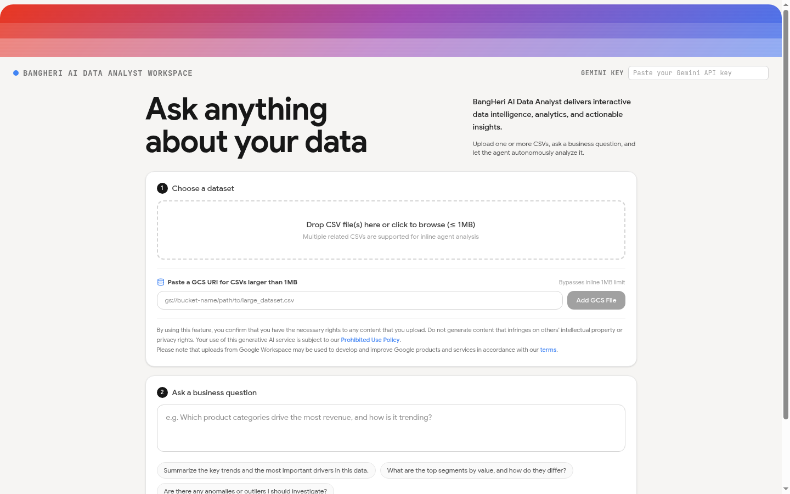

# BangHeri Data Analyst

A web app that turns raw CSV files into an interactive data-analysis report.
A user uploads one or more CSVs, asks a business question in plain language,
and a Gemini-hosted agent autonomously profiles the data, runs Python
(pandas / numpy / matplotlib) in a remote sandbox, renders charts, and
streams an interactive dashboard back to the browser.

> **Status: pre-release portfolio build (v0.x).** The fully automated
> validation (tests, lint, build, local smoke test) passes, but the live
> provider and GCS flows still require manual verification — see
> [Validation Boundaries](#validation-boundaries).

---

## The problem

Getting a quick, reproducible answer from a messy CSV usually means writing
Python, setting up notebooks, and manually generating charts — slow and
error-prone for non-technical users.

## The solution

Paste in a CSV, type a question, and get a structured report with charts,
statistics, and step-by-step analysis — generated by an AI agent that writes
and runs the Python for you, entirely from your browser.

---

## Key features

- **CSV in, report out** — upload CSV files (inline, up to **1 MB per file**) or
  reference files via **GCS URIs**, ask a business question, and receive an
  interactive dashboard.
- **Agentic analysis** — the request ships the whole agent bundle to a
  Gemini-hosted sandbox; the agent profiles the data, runs Python, and builds
  charts and a `report.json`.
- **Live progress** — analysis events stream back over an SSE connection with a
  15 s keep-alive heartbeat, shown in a real-time activity log.
- **Follow-up questions** — subsequent questions reuse the same warm sandbox
  environment instead of re-uploading data.
- **Export** — reports can be exported to **PDF** (jsPDF + autotable).
- **Bring Your Own Key (BYOK)** — no server-side Gemini key is required (see
  [BYOK mechanism](#bring-your-own-key-byok)).

---

## Tech stack

| Layer | Technology |
|---|---|
| Frontend | React 19, Tailwind CSS v4, Vite 6, lucide-react, react-markdown, motion |
| Backend | Node.js, Express 4, TypeScript (run via `tsx`, bundled with esbuild) |
| Uploads / body | multer (1 MB/file cap), express.json (10 MiB ceiling) |
| AI | Google Gemini Interactions API — agent `antigravity-preview-05-2026` |
| Remote analysis | Python sandbox: pandas, numpy, matplotlib |
| Testing | `node --test` + `tsx` (no external test framework) |

---

## Architecture (brief)

The app has three tiers; one of them runs remotely:

1. **Browser SPA** (`src/App.tsx`) — upload UI, chat, live activity log, and
   the report dashboard. Talks to the local server over an SSE stream and
   stores saved reports in `localStorage`.
2. **Local orchestrator** (`server.ts` + `server/lib/`) — an Express proxy
   between the browser and Google's Interactions API. It bundles the `agent/`
   tree plus the user's CSVs into the request, streams agent events back to the
   browser, then downloads the sandbox's file snapshot, extracts
   `report.json` + chart PNGs, and emits a final report event. Charts are
   served from `/output/...`.
3. **Remote agent** (`agent/`) — the system prompt + skills executed inside the
   Gemini sandbox: it profiles data, runs `make_chart.py` and
   `build_report.py`, and writes the report contract to
   `./workspace/data/report.json`.

```
browser upload → POST /api/upload → ask a question → POST /api/analyze
   → server bundles agent/ + CSVs → createInteraction (SSE)
   → agent runs Python in sandbox → report.json + charts
   → server downloads tar snapshot → SSE "report_data" → dashboard renders
```

Follow-ups reuse the same `environmentId` (warm sandbox) instead of
re-uploading data.

---

## Screenshots / demo

**Upload screen** — clean local render, no keys or data:



- **Report screenshot:** coming after controlled provider validation. A real
  analysis report cannot be produced without a live provider call, so it is not
  faked here.
- **Live demo:** deployment in progress — a public URL will be added once a
  deployment is available.

---

## Local setup

**Prerequisites:** Node.js ≥ 20.

```bash
npm install
cp .env.example .env.local   # then adjust values — see below
npm run dev                  # Express + Vite in one process on port 3000
```

Production build:

```bash
npm run build                # vite build (SPA → dist/) + esbuild → dist/server.cjs
npm run start                # node dist/server.cjs (requires a prior build)
```

Quality gates:

```bash
npm run lint                 # tsc --noEmit (typecheck)
node --import tsx --test tests/*.test.ts   # 29 unit tests
```

The server port auto-increments if the configured port is already in use.

## Environment variables

No secrets are required to run the app — users bring their own Gemini API key
(see below). Copy `.env.example` to `.env.local` and set as needed:

| Variable | Required | Description |
|---|---|---|
| `PORT` | no (default `3000`) | Server port (integer 1–65535). |
| `NODE_ENV` | no (`development` default) | `development` or `production`. |
| `PUBLIC_BASE_URL` | **production only** | Absolute `https://` URL of this server, used by sandbox scripts that call back into the app (e.g. GCS downloads). Fail-closed: production refuses to start without it. Not a secret. |
| `DAILY_QUOTA_LIMIT` | no | Optional integer daily quota limit; left empty it uses the default. |

There is **no server-side `GEMINI_API_KEY`** — do not set one.

---

## Bring Your Own Key (BYOK)

This app has no server-side Gemini key. Each user supplies their own Gemini API
key in the UI header:

- The key is held **only in browser memory** for the life of the page — never
  written to `localStorage`, `sessionStorage`, cookies, or the URL.
- On **Run**, the key is sent to `/api/analyze` in the `x-gemini-api-key`
  header and forwarded **only to Google** so the analysis can run.
  `/api/upload` and `/api/health` never receive the key.
- The server never logs, stores, or returns the key. A missing or malformed key
  is rejected with a `400` before any network call.
- Because the key travels in a request header over HTTPS, the key owner can see
  it in the browser's Network DevTools — that is inherent to BYOK and expected.
- A **Clear** button removes the key from browser memory. The key carries the
  user's own quota and billing responsibility.

---

## Security controls

| ID | Control | Where |
|---|---|---|
| **R01** | GCP metadata is consulted **only when a request actually contains GCS files**, and at most **one** attempt is made — no retries, no unconditional fallback, and non-OK/throw results become `null`. The token is never logged. | `server/lib/gcpToken.ts` |
| **R04** | Global **10 MiB JSON body ceiling** (previously 50 MB). Oversized or malformed bodies return fixed `413` / `400` JSON with no raw body, stack, or `err.message` leak. | `server/lib/bodyLimit.ts`, `server.ts` |
| **R27** | **Fail-closed** GCS guard: when a request carries GCS files but the GCS access token could not be resolved, the request returns `503` **before** any instruction construction, SSE response, or provider call. The response never leaks the token, `gsUri`, metadata hostname, stack, or `err.message`. | `server/lib/gcsAvailability.ts`, `server.ts` |

Additional safeguards: BYOK keys are validated centrally and rejected before
any network call (`server/lib/keyValidation.ts`), server logging is metadata-only
via a safe-diagnostics allowlist (never raw exceptions or user content), and
per-IP / per-key rate limits act as abuse guards.

---

## Quality evidence

- **Unit tests: 29/29 PASS** — `r01-metadata` (8), `r04-body-limit` (13),
  `r27-gcs-fail-closed` (8).
- **Lint:** `tsc --noEmit` passes.
- **Build:** `vite build` + esbuild succeed.
- **Local smoke test (production mode, offline):** health check, frontend shell
  + asset delivery, basic upload, malformed-body rejection (`400`), oversize
  rejection (`413`, R04), BYOK request gates (`400` before any network call),
  SPA routing, and no key leakage in responses or server logs all passed.

This is a smoke test on the local machine only — it did **not** call the
provider or the GCS metadata endpoint (see boundaries below).

## Validation boundaries

- This is a **portfolio/pre-release build**, not a claim of full
  production-grade readiness.
- The **Gemini provider flow is not end-to-end tested** in this repository —
  the first live analysis with a real key requires a controlled manual test.
- The **GCS path is not end-to-end tested** — resolving a GCS token requires
  access to a metadata endpoint (e.g. in a Google Cloud environment), which was
  deliberately not exercised here.
- Not every security risk is closed: the GCS **file-count** bounding (R06) is
  only partially mitigated (1 MB/file cap + 10 MiB body ceiling).

---

## Roadmap

- [x] Add upload-screen screenshot to this README.
- [ ] Add report screenshot after a controlled live provider test.
- [ ] Controlled live test: first real Gemini analysis (small synthetic CSV).
- [ ] Verify the GCS file path end-to-end in an environment with metadata
      access.
- [ ] Close R06: bound the number of GCS files per request.
- [ ] Live demo link once a deployment is available.
- [ ] Push and deploy for public portfolio viewing.
